# Taller práctico Cloud & DevOps


## Objetivo
Vamos a editar y desplegar en el proveedor "Google Cloud Platform" una web app sencilla hecha en python para que sea accesible públicamnete desde internet. 

Para ello usaremos el servicio de máquinas virtuales de Google Cloud Platform (en adelante GCP) "Compute Engine".

Configuraremos la "Compute Engine" con todo lo necesario para desplegar la aplicación, y por último accederemos a la ip pública de la máquina para ver nuestra página desplegada desde un navegador.

Una vez estemos en la máquina, nos clonaremos los archivos necesarios del repositorio de Git https://github.com/diegomggp/Experience-Day-Cloud.git
para poder usarlos en la máquina.

Por tanto, usaremos:
- La consola (interfaz gráfica de GCP)
- Git
- Algunos comandos de linux para preparar lo necesario, editar y lanzar la app dentro de la máquina


## Pasos
### Paso 1 - Ingresar a la consola de Google Cloud Platform:

- Nos logueamos en GCP https://console.cloud.google.com/?hl=es

### Paso 2 - Crear una instancia de "Compute Engine":

- Selecionamos Compute Engine

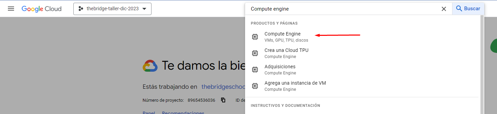


- Seleccionamos Crear instancia

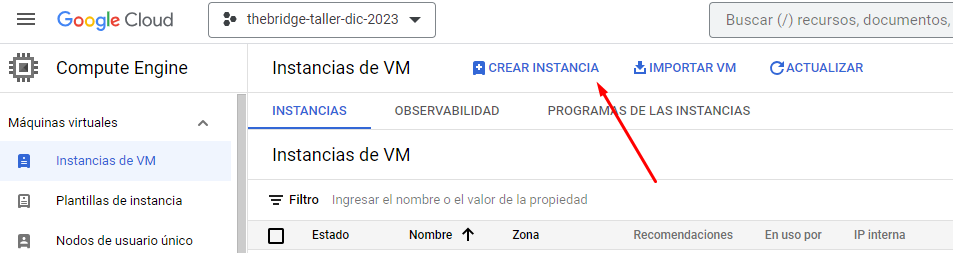


- Le damos un nombre a la instancia, y selecionamos región `europe-west1 (Belgica)`
- Dejamos la configuración y tipo de máquina en las que vienen por defecto

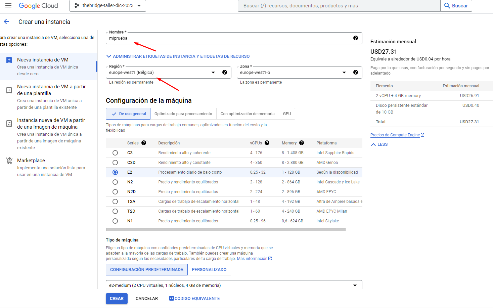

- En la seccion de disco de arranque le damos a cambiar y elegimos `Ubuntu`:

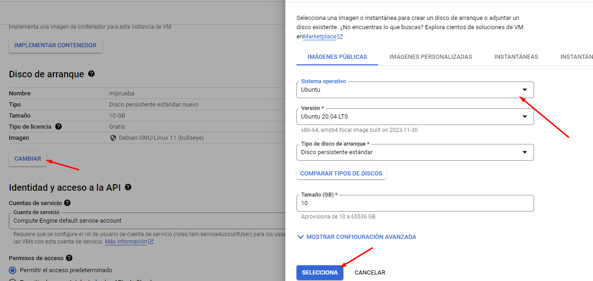

- En Firewall, marcamos permitir tráfico HTTP y HTTPS y damos a "Crear"

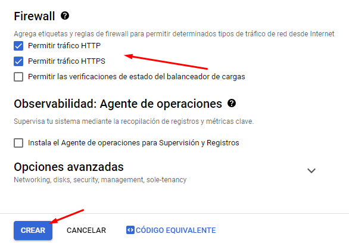

- Cuando termine de crearse la veremos en estado operativo, en verde. Y la seleccionamos

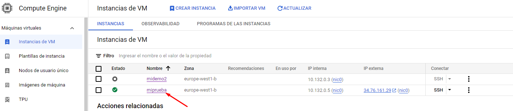

### Paso 3 - Conectar a nuestra instancia de "Compute Engine":

- Aquí seleccionamos SSH para conectarnos a la máquina

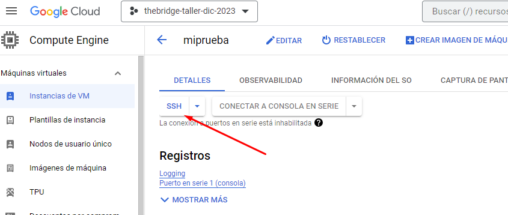

- Seleccionamos "Autorizar"

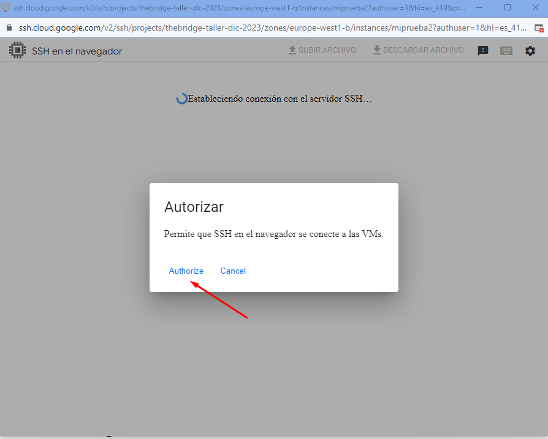

- Y ya tenemos lista nuestra terminal de ubuntu en la máquina virtual

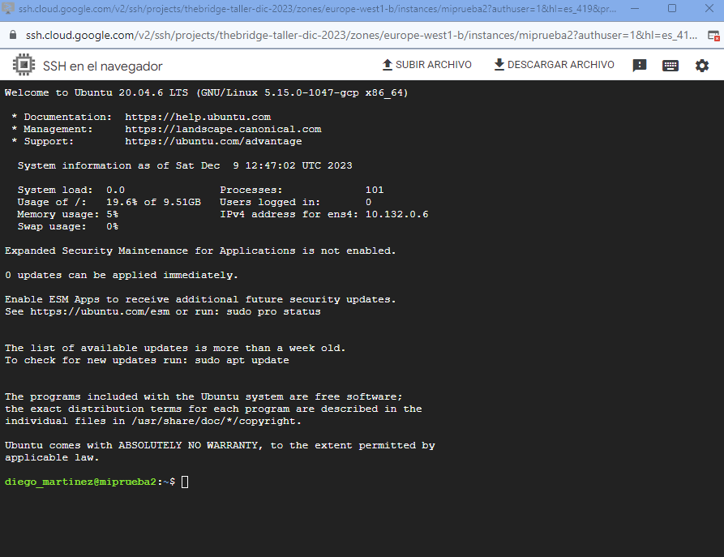

### Paso 4 - Clonar el repo :

- Introducimos este comando en la terminal: 
```bash
git clone https://github.com/diegomggp/Experience-Day-Cloud.git
```
Esto nos habrá clonado el repositorio. 

Para comprobarlo introducimos este comando en la terminal:
```bash
ls
```
Esto lista los archivos y directorios existentes. En este caso veremos el directorio con el contenido del repo clonado.

Para entrar en el directorio introducimos este comando:
```bash
cd Experience-Day-Cloud/
```
Y otra vez el mismo de antes, para ver lo que hay dentro de ese directorio
```bash
ls
```
Este será el aspecto:

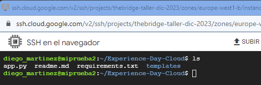

### Paso 5 - Configurar la app, la máquina y lanzar la app:

- Metemos el comando, para editar la app con el editor nano:

```bash
nano app.py
```
- En el editor, metemos nuestro nombre, p.ej: Diego

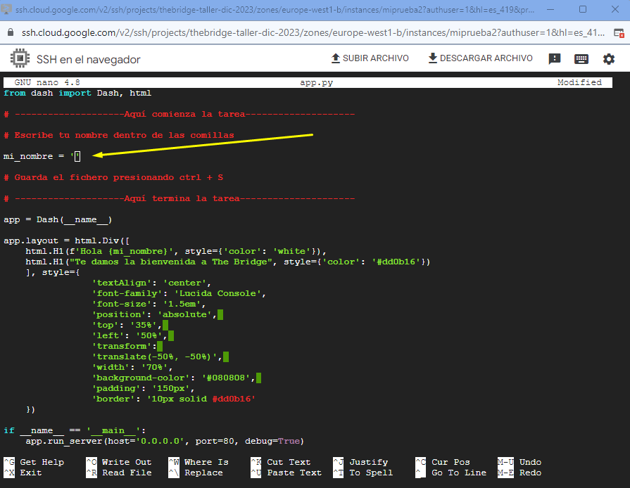

- Guardamos los cambios:
```bash
Pulsamos Ctrl+X
Pulsamos tecla Y
Pulsamos tecla Intro
```
- A continuación introducimos uno a uno los siguientes comandos:

```bash
sudo apt-get update
sudo apt install python3-pip
sudo pip install -r requirements.txt
sudo python3 app.py
```
- Al finalizar, veremos algo así en la terminal:

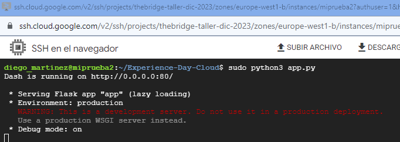

Esto ejecutará la app exponiendo por la ip externa que le asigne GCP y puerto que se define en nuestro archivo app.py


### Paso 6 - Acceder a nuestro servicio web en el navegador:

- Ahora vamos a la vista general de máquinas virtuales y copiamos la ip externa, en el caso de el ejemplo es ``34.38.22.122``

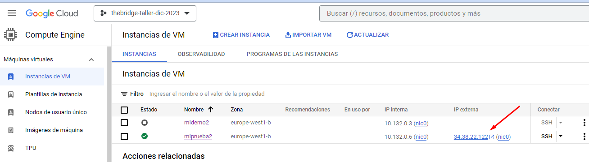


- En el navegador introducimos esta URL (cambiando cada uno a la ip de su máquina):

```bash
http://34.38.22.122:80
```

- Comprobamos así que nuestro servico está levantado y accesible públicamente desde intenet:

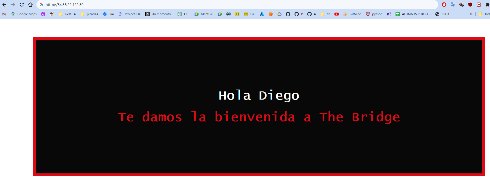